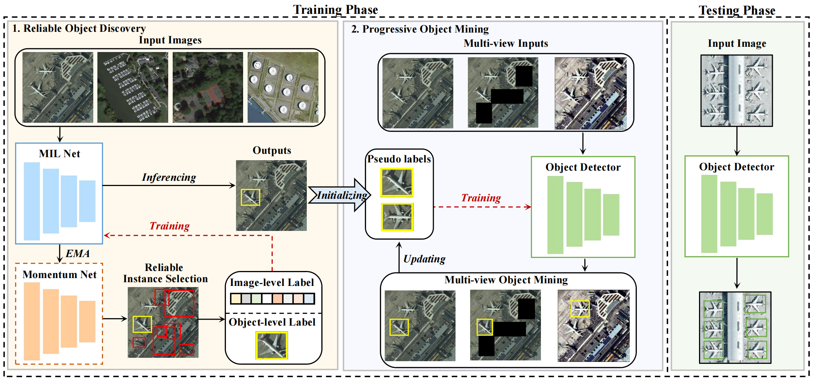

# MOL
The official code of "MOL: Towards Accurate Weakly Supervised Remote Sensing Object Detection via Multi-view nOisy Learning".



## Get Started-Stage 1
### Installation
```Shell
conda create -n MOL-1 python=3.6
pip install torch==1.4.0 torchvision==0.5.0
cd MOL-1/lib
bash make_cuda.sh
```
### Data Preparation
Download the NWPU VHR-10.v2/DIOR dataset and put them into the `./MOL-1/data` directory. For example:
```Shell
  ./MOL-1/data/NWPU/                           
  ./MOL-1/data/NWPU/Annotations
  ./MOL-1/data/NWPU/JPEGImages
  ./MOL-1/data/NWPU/ImageSets    
```
Utilizing the selective search tools implemented in opencv-python to generate candidate proposals and put them into the `./MOL-1/data/selective_search_data`. For example:
```Shell
  ./MOL-1/data/selective_search_data/NWPU_train.mat                           
  ./MOL-1/data/selective_search_data/NWPU_val.mat
  ./MOL-1/data/selective_search_data/NWPU_test.mat  
```

### Training
```Shell
bash ./configs/NWPU/train_30000.sh 0 NWPU vgg16 model_name
```
### Testing
```Shell
bash ./configs/NWPU/test_30000.sh 0 NWPU vgg16 model_name
```
### Generating Pseudo-labels
```Shell
python gen_pseudo_labels.py ./predictions_dir ./NWPU_trainval.json
```

## Get Started-Stage 2
### Installation
```Shell
conda create -n MOL-2 python=3.6
cd MOL-2
pip install -e cvpods --user
cd cvpods
python setup.py develop
```
### Data Preparation
Download the NWPU VHR-10.v2/DIOR dataset and put them into the `./MOL-2/cvpods/datasets` directory. For example:
```Shell
  ./MOL-2/cvpods/datasets/NWPU/                           
  ./MOL-2/cvpods/datasets/NWPU/annotations/NWPU_trainval.json
  ./MOL-2/cvpods/datasets/NWPU/annotations/NWPU_test.json
  ./MOL-2/cvpods/datasets/NWPU/train2017  
  ./MOL-2/cvpods/datasets/NWPU/val2017    
```

### Training
```Shell
CUDA_VISIBLE_DEVICES=0 pods_train --num-gpus 1 --dir ./MOL
```
### Testing
```Shell
CUDA_VISIBLE_DEVICES=0 pods_test --num-gpus 1 --dir ./MOL MODEL.WEIGHTS ./MOL/model_final.pth
```
